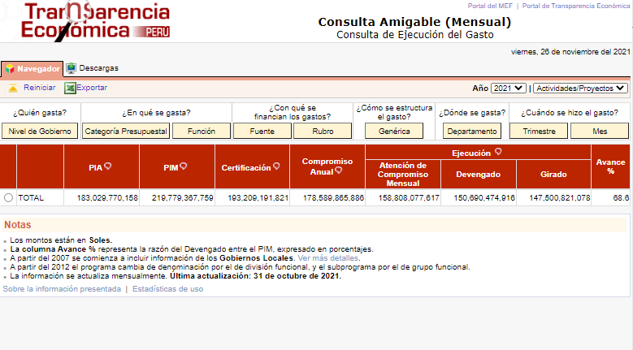

# MEF Scraper
A scraper design with Scrapy to get data from https://apps5.mineco.gob.pe/transparencia/mensual. It gets reports for different parameters like month, year, "Nivel de Gobierno", etc at collets the data in one file.

The results are then stored in a local directory and can be easily uploaded to a S3 bucket.



## Installation
Clone the repository:
```
git clone https://github.com/Ed1123/MEF-Scraper.git
```
Install the requirements:
```
pip install -r requirements.txt
```

## Usage
To use it simply run the following in the project directory:
```bash
scrapy crawl <spider_name> # either mef_1 or mef_2
```
The results will be save in a folder called `output/<spider_name>`.

__Note:__ By default the mef_1 spider will take the month before. If you want to process a list of other dates you will have to provide a month and/or a year as an argument as follows:
```bash
scrapy crawl mef_1 -a month=1 -a year=2021
```
If only one is provided, the code will take the current one.

### Upload to S3
To store the results in a S3 bucket add the following environment variables with the corresponding data:
```
AWS_KEY=
AWS_SECRET=
AWS_BUCKET=
```
You can also create an `.env` file with the environment variables.

Then uncomment the following lines in the `aliaxis/settings.py` file:
```python
# AWS S3
aws_key = os.getenv('AWS_KEY')
aws_secret = os.getenv('AWS_SECRET')
aws_bucket = os.getenv('AWS_BUCKET')
FEEDS = {
    f's3://{aws_key}:{aws_secret}@{aws_bucket}/{FILEPATH}.pickle': {
        'format': 'pickle',
    },
    f'{FILEPATH}.csv': {
        'format': 'csv',
    }
}
```
Finally run the scraper once more and the results will be also saved to the S3 bucket.
